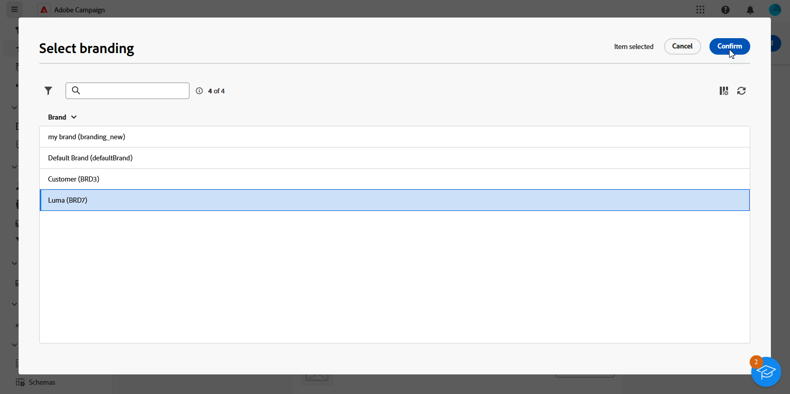

# ブランドの割り当て {#branding-assign}

>[!IMPORTANT]
>
>ブランディングオプションは、現在、メール配信とプッシュ配信に制限されています。

## テンプレートへのブランドのリンク {#linking-a-brand-to-a-template}

ブランド用に定義したパラメーターを使用するには、配信テンプレートにリンクする必要があります。 それには、テンプレートを作成または編集する必要があります。

テンプレートはブランドにリンクされます。 メールエディターでは、「**Email address of default sender**」、「**Default sender name**」、「**Logo**」などの要素では、設定済みのブランドデータが使用されます。

>[!BEGINTABS]

>[!TAB Adobe Campaign V8]

配信テンプレートを作成するには、組み込みテンプレートの複製、既存の配信のテンプレートへの変換、最初からの配信テンプレートの作成を行います。 [詳細情報](https://experienceleague.adobe.com/en/docs/campaign/campaign-v8/send/create-templates)

テンプレートを作成したら、それをブランドにリンクできます。その手順は次のとおりです。

1. を参照 **[!UICONTROL リソース]** `>` **[!UICONTROL テンプレート]** `>` **[!UICONTROL 配信テンプレート]** Adobe Campaign エクスプローラー。

1. 配信テンプレートを選択するか、既存の配信テンプレートを複製します。

   

1. へのアクセス **[!UICONTROL プロパティ]** 選択した配信テンプレート

   

1. から **[!UICONTROL 一般]** タブで、ブランドを **[!UICONTROL ブランド化]** ドロップダウン。

   

1. 設定が完了したら、次を選択します。 **OK**.

これで、このテンプレートを使用して配信を送信できます。

>[!TAB Adobe Campaign Web]

配信テンプレートを作成するには、組み込みテンプレートの複製、既存の配信のテンプレートへの変換、最初からの配信テンプレートの作成を行います。 [詳細情報](https://experienceleague.adobe.com/en/docs/campaign-web/v8/msg/delivery-template)

テンプレートを作成したら、それをブランドにリンクできます。その手順は次のとおりです。

1. を参照してください。 **[!UICONTROL テンプレート]** タブ、から **[!UICONTROL 配信]** 左側のメニューをクリックし、配信テンプレートを選択します。

   

1. 「**[!UICONTROL 設定]**」をクリックします。

   

1. から **[!UICONTROL 配信]** タブに移動し、次にアクセスします **[!UICONTROL ブランド化]** フィールドに入力し、テンプレートにリンクするブランドを選択します。

   

1. 選択内容を確定し、テンプレートを保存します。

これで、このテンプレートを使用して配信を送信できます。

>[!ENDTABS]

## 配信へのブランドの割り当て {#assigning-a-brand-to-an-email}

>[!BEGINTABS]

>[!TAB Adobe Campaign V8]

新しいスタンドアロン配信を作成するには、次の手順に従います。

1. 新しい配信を作成するには、を参照します。 **[!UICONTROL キャンペーン]** タブ。

1. クリック **[!UICONTROL 配信]** をクリックし、 **[!UICONTROL 作成]** ボタンが、既存の配信のリストの上に表示されます。

   

1. 配信テンプレートを選択します。

1. へのアクセス **[!UICONTROL プロパティ]** 選択した配信テンプレート

   

1. から **[!UICONTROL 一般]** タブで、ブランドを **[!UICONTROL ブランド化]** ドロップダウン。

   

1. 設定が完了したら、次を選択します。 **OK**.

1. 配信をさらにパーソナライズします。 メールの作成について詳しくは、 [メールのデザインと送信](https://experienceleague.adobe.com/en/docs/campaign-web/v8/msg/email/create-email) セクション。

>[!TAB Adobe Campaign Web]

新しいスタンドアロン配信を作成するには、次の手順に従います。

1. を参照してください。 **[!UICONTROL 配信]** 左パネルのメニューで、 **[!UICONTROL 配信を作成]** ボタン。

   

1. 「メール」または「プッシュ通知」をチャネルとして選択し、リストから配信テンプレートを選択します。

1. 「**[!UICONTROL 配信を作成]**」ボタンをクリックして、確定します。

1. から **[!UICONTROL プロパティ]** ページ、クリック **[!UICONTROL 設定]**.

   

1. から **[!UICONTROL 配信]** タブに移動し、次にアクセスします **[!UICONTROL ブランド化]** フィールド。

   

1. テンプレートにリンクするブランドを選択します。

   

1. 配信をさらにパーソナライズします。 メールの作成について詳しくは、 [最初のメールを作成](https://experienceleague.adobe.com/en/docs/campaign-web/v8/msg/email/create-email) セクション。

>[!ENDTABS]
