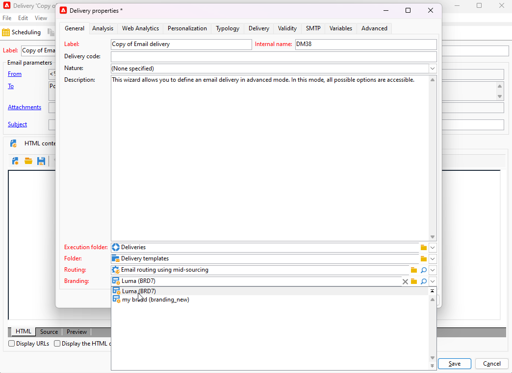
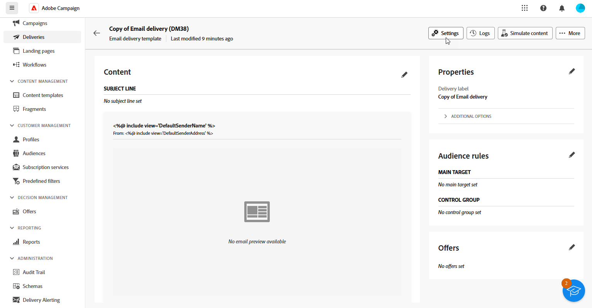

# ブランドの割り当て {#branding-assign}

## テンプレートへのブランドのリンク {#linking-a-brand-to-a-template}

ブランドに定義したパラメーターを使用するには、そのブランドが配信テンプレートにリンクされている必要があります。 それには、テンプレートを作成または編集する必要があります。

これで、テンプレートはブランドにリンクされます。 メールエディターでは、「**Email address of default sender**」、「**Default sender name**」、「**Logo**」などの要素では、設定済みのブランドデータが使用されます。

>[!BEGINTABS]

>[!TAB Adobe Campaign v8]

配信テンプレートを作成するには、組み込みテンプレートの複製、既存の配信のテンプレートへの変換またはゼロから配信テンプレートの作成を行います。 [詳細情報](https://experienceleague.adobe.com/ja/docs/campaign/campaign-v8/send/create-templates)

テンプレートを作成したら、それをブランドにリンクできます。 その手順は次のとおりです。

1. Adobe Campaign エクスプローラーで、**[!UICONTROL リソース]** `>` **[!UICONTROL テンプレート]** `>` **[!UICONTROL 配信テンプレート]**&#x200B;に移動します。

1. 配信テンプレートを選択するか、既存の配信テンプレートを複製します。

   

1. 選択した配信テンプレートの&#x200B;**[!UICONTROL プロパティ]**&#x200B;にアクセスします。

   

1. 「**[!UICONTROL 一般]**」タブの&#x200B;**[!UICONTROL ブランディング]**&#x200B;ドロップダウンからブランドを選択します。

   

1. 設定が完了したら、「**OK**」を選択します。

これで、このテンプレートを使用して配信を送信できるようになりました。

>[!TAB Adobe Campaign web]

配信テンプレートを作成するには、組み込みテンプレートの複製、既存の配信のテンプレートへの変換またはゼロから配信テンプレートの作成を行います。 [詳細情報](https://experienceleague.adobe.com/ja/docs/campaign-web/v8/msg/delivery-template)

テンプレートを作成したら、それをブランドにリンクできます。 その手順は次のとおりです。

1. **[!UICONTROL 配信]**&#x200B;の左側のメニューから、「**[!UICONTROL テンプレート]**」タブに移動し、配信テンプレートを選択します。

   

1. 「**[!UICONTROL 設定]**」をクリックします。

   

1. 「**[!UICONTROL 配信]**」タブから、「**[!UICONTROL ブランディング]**」フィールドにアクセスし、テンプレートにリンクするブランドを選択します。

   

1. 選択内容を確定し、テンプレートを保存します。

これで、このテンプレートを使用して配信を送信できるようになりました。

>[!ENDTABS]

## 配信へのブランドの割り当て {#assigning-a-brand-to-an-email}

>[!BEGINTABS]

>[!TAB Adobe Campaign v8]

新しいスタンドアロン配信を作成するには、次の手順に従います。

1. 新しい配信を作成するには、「**[!UICONTROL キャンペーン]**」タブに移動します。

1. 「**[!UICONTROL 配信]**」をクリックし、既存の配信リストの上にある「**[!UICONTROL 作成]**」ボタンをクリックします。

   

1. 配信テンプレートを選択します。

1. 選択した配信テンプレートの&#x200B;**[!UICONTROL プロパティ]**&#x200B;にアクセスします。

   

1. 「**[!UICONTROL 一般]**」タブの&#x200B;**[!UICONTROL ブランディング]**&#x200B;ドロップダウンからブランドを選択します。

   

1. 設定が完了したら、「**OK**」を選択します。

1. 配信をさらにパーソナライズします。 メールの作成について詳しくは、[メールのデザインと送信](https://experienceleague.adobe.com/en/docs/campaign-web/v8/msg/email/create-email)の節を参照してください。

>[!TAB Adobe Campaign web]

新しいスタンドアロン配信を作成するには、次の手順に従います。

1. 左側のパネルの&#x200B;**[!UICONTROL 配信]**&#x200B;メニューを参照し、「**[!UICONTROL 配信を作成]**」ボタンをクリックします。

   

1. 「メール」または「プッシュ通知」をチャネルとして選択し、リストから配信テンプレートを選択します。

1. 「**[!UICONTROL 配信を作成]**」ボタンをクリックして、確定します。

1. **[!UICONTROL プロパティ]**&#x200B;ページから、「**[!UICONTROL 設定]**」をクリックします。

   

1. 「**[!UICONTROL 配信]**」タブから、「**[!UICONTROL ブランディング]**」フィールドにアクセスします。

   

1. テンプレートにリンクするブランドを選択します。

   

1. 配信をさらにパーソナライズします。 メールの作成について詳しくは、[最初のメールの作成](https://experienceleague.adobe.com/en/docs/campaign-web/v8/msg/email/create-email)の節を参照してください。

>[!ENDTABS]
