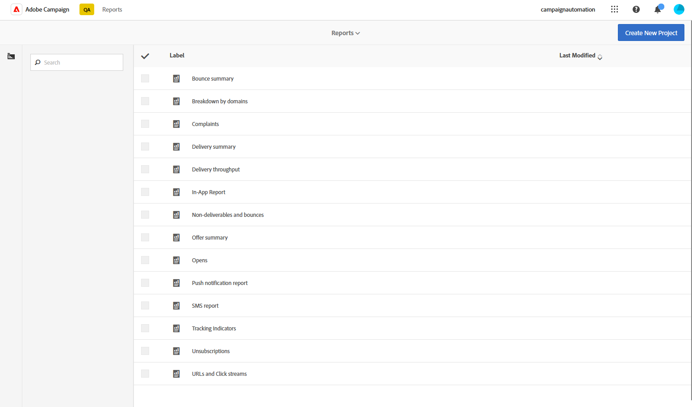

# 動的レポートの基本を学ぶ {#about-dynamic-reports}

動的レポートは、完全にカスタマイズ可能なリアルタイムのレポートを提供します。 プロファイルデータへのアクセスが追加され、開封数やクリック数などの機能的なメールキャンペーンデータに加えて、性別、市区町村、年齢などのプロファイルディメンション別のデモグラフィック分析を可能にします。ドラッグ&amp;ドロップインターフェイスを使用すると、データを調査し、最も重要な顧客セグメントに対するメールキャンペーンのパフォーマンスを判断し、受信者に与える影響を測定できます。

## 動的レポートへのアクセス {#accessing-dynamic-reports}

レポートは、「**レポート** をクリックして、キャンペーンおよび配信ごとにアクセスできます。 ポップアップウィンドウが表示され、新しいブラウザータブで **動的レポート** ページにリダイレクトされることが通知されます。

情報の収集と処理にかかる時間によっては、配信直後に特定のレポートを使用できないことがあります。

動的レポートは次の 2 つのカテゴリに分かれています。

* **テンプレート** （**名前を付けて保存** オプション（**プロジェクト/名前を付けて保存…**）を選択します。
* **カスタムレポート** （青で識別）。（レポート **ホームページの「** 新規プロジェクトの作成 **」ボタンをクリックして直接作成でき** す。

