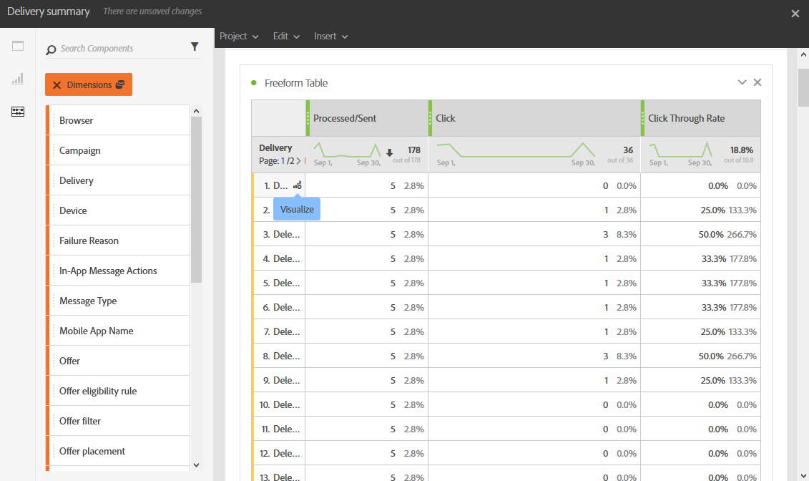

# パネルの追加{#adding-panels}

## 空のパネルの追加 {#adding-a-blank-panel}

レポートを開始するには、一連のパネルを標準またはカスタムレポートに追加します。 各パネルには、様々なデータセットが含まれ、フリーフォームテーブルおよびビジュアライゼーションで構成されます。

このパネルを使用すると、必要に応じてレポートを作成できます。 異なる期間でデータをフィルタリングするために、レポートに必要な数のパネルを追加できます。

1. **パネル** アイコンをクリックします。 また、「挿入」タブをクリックして **新しい空のパネル** を選択することで、パネルを追加す **こともでき** す。

   

1. **空のパネル** をダッシュボードにドラッグ&amp;ドロップします。

   

これで、フリーフォームテーブルをパネルに追加して、データのターゲット設定を開始できます。

## フリーフォームテーブルの追加 {#adding-a-freeform-table}

フリーフォームテーブルを使用すると、**コンポーネント** テーブルで使用できる様々な指標やディメンションを使用して、データを分析するテーブルを作成できます。

各テーブルとビジュアライゼーションはサイズ変更可能で、移動してレポートをカスタマイズできます。

1. **[!UICONTROL パネル]** アイコンをクリックします。

   

1. **[!UICONTROL フリーフォーム]** 項目をダッシュボードにドラッグ&amp;ドロップします。

   また、「**[!UICONTROL 挿入]**」タブをクリックして **[!UICONTROL 新しいフリーフォーム]** を選択するか、空のパネルで **[!UICONTROL フリーフォームテーブルを追加]** をクリックして、テーブルを追加することもできます。

   

1. 「**[!UICONTROL セグメントをここにドロップ]**」フィールドで、「**[!UICONTROL コンポーネント]**」タブから上部のバーに **[!UICONTROL セグメント]** を追加します。

   

1. 「**[!UICONTROL コンポーネント]**」タブから列と行に項目をドラッグ&amp;ドロップして、テーブルを作成します。

   

1. **[!UICONTROL 設定]** アイコンをクリックして、列でのデータの表示方法を変更します。

   

   **[!UICONTROL 列設定]** は、次の要素で構成されます。

   * **[!UICONTROL 数値]**：列の概要数値の表示と非表示を切り替えることができます。
   * **[!UICONTROL パーセント]**：列でパーセントの表示と非表示を切り替えることができます。
   * **[!UICONTROL ゼロを値なしで解釈]**：値が 0 と等しい場合に表示または非表示にできます。
   * **[!UICONTROL 背景]**：セル内の水平プログレスバーの表示と非表示を切り替えることができます。
   * **[!UICONTROL 再試行を含める]**：結果に再試行を含めることができます。 これは、**[!UICONTROL 送信済み]** および **[!UICONTROL バウンス + エラー]** でのみ使用できます。

1. 1 つまたは複数の行を選択して、「**[!UICONTROL 視覚化]**」アイコンをクリックします。 ビジュアライゼーションが追加され、選択した行が反映されます。

   

必要な数のコンポーネントを追加し、ビジュアライゼーションを追加して、データをグラフで表示できるようになりました。
