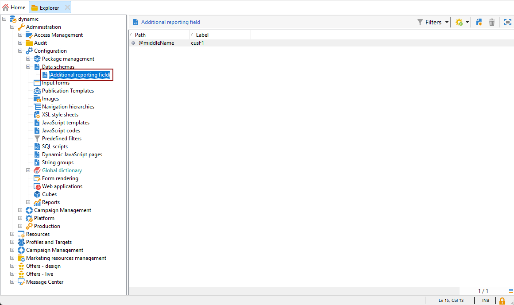

# プロファイルディメンションの作成{#creating-a-custom-profile-dimension}

レポートは、受信者スキーマの拡張時に作成されたプロファイルデータに基づいて作成および管理することもできます。

* [手順 1：受信者スキーマを拡張する](##extend-schema)
* [手順 2：新しいカスタムフィールドをリンクする](#link-custom)
* [手順 3：プロファイルディメンションを使用して受信者をフィルタリングするための動的レポートの作成](#create-report)

## 手順 1：受信者スキーマを拡張する {#extend-schema}

新しいプロファイルフィールドを追加するには、スキーマを拡張する必要があります。次の手順に従います。

1. エクスプローラーの **[!UICONTROL 管理]**/**[!UICONTROL 設定]**/**[!UICONTROL データスキーマ]** フォルダーに移動します。

   

1. カスタム受信者スキーマを特定して選択します。 組み込みの nms:recipient スキーマをまだ拡張していない場合は、[ この手順 ](https://experienceleague.adobe.com/en/docs/campaign/campaign-v8/developer/shemas-forms/extend-schema) を参照してください。

1. カスタムフィールドをスキーマエディターに追加します。

   例えば、受信者スキーマにロイヤルティのカスタムフィールドを追加するには、次のようにします。

   ```
   <attribute label="Loyalty" name="loyalty" type="string"/>
   ```

   

1. 「**[!UICONTROL 保存]**」をクリックします。

1. 次に、カスタム broadLogRcp スキーマを特定して選択します。 ビルトインの配信ログスキーマをまだ拡張していない場合は、[ この手順 ](https://experienceleague.adobe.com/en/docs/campaign/campaign-v8/developer/shemas-forms/extend-schema) を参照してください。

1. 受信者スキーマと同じカスタムフィールドをスキーマエディターに追加します。

   

1. 「**[!UICONTROL 保存]**」をクリックします。

1. スキーマに加えた変更を適用するには、**[!UICONTROL ツール]**/**[!UICONTROL 詳細]**/**[!UICONTROL データベース構造を更新]** からデータベース更新ウィザードを起動して、データベース構造を更新を実行します。 [詳細情報](https://experienceleague.adobe.com/en/docs/campaign/campaign-v8/developer/shemas-forms/update-database-structure)

   

これで、受信者が新しいプロファイルフィールドを使用して選択する準備が整いました。

## 手順 2：新しいカスタムフィールドをリンクする {#link-custom}

>[!NOTE]
>
> 動的レポートには、最大 20 個のカスタムフィールドを追加できます。

プロファイルフィールドを作成したので、対応する動的レポートディメンションにリンクする必要があります。

プロファイルフィールドを使用してログを拡張する前に、PII データを動的レポートに送信できるように PII ウィンドウが許可されていることを確認します。 詳しくは、この[ページ](pii-agreement.md)を参照してください。

1. エクスプローラーの **[!UICONTROL 管理]**/**[!UICONTROL 設定]**/**[!UICONTROL データスキーマ]**/**[!UICONTROL 追加のレポートフィールド]** フォルダーに移動します。

   

1. **[!UICONTROL 新規]** をクリックして、対応する動的レポートディメンションを作成します。

1. **[!UICONTROL 式を編集]** を選択し、受信者スキーマを参照して、以前に作成したプロファイルフィールドを見つけます。

   

1. 「**[!UICONTROL 完了]**」をクリックします。

1. 動的レポートに表示されるディメンション **[!UICONTROL ラベル]** を入力し、「**[!UICONTROL 保存]**」をクリックします。

   

これで、プロファイルフィールドをプロファイルディメンションとしてレポートで使用できるようになりました。 プロファイルディメンションを削除するには、ディメンションを選択して **[!UICONTROL 削除]** アイコンをクリックします。

これで、このプロファイルフィールドとカスタムディメンションを作成して受信者スキーマを拡張したので、配信での受信者のターゲティングを開始できます。

## 手順 3：プロファイルディメンションを使用して受信者をフィルタリングするための動的レポートの作成 {#create-report}

配信を送信したら、プロファイルディメンションを使用してレポートを分類できます。

1. 「**[!UICONTROL レポート]**」タブから、標準レポートを選択するか、「**[!UICONTROL 作成]**」ボタンをクリックして最初から作成します。

   

1. 「**[!UICONTROL Dimension]**」カテゴリで、「プロファイル **[!UICONTROL をクリックし、プロファイルディメンションをフリーフォームテーブルにドラッグ&amp;ドロップします。]**

   

1. 指標をドラッグ&amp;ドロップして、データのフィルタリングを開始します。

1. 必要に応じて、ビジュアライゼーションをワークスペースにドラッグ&amp;ドロップします。

