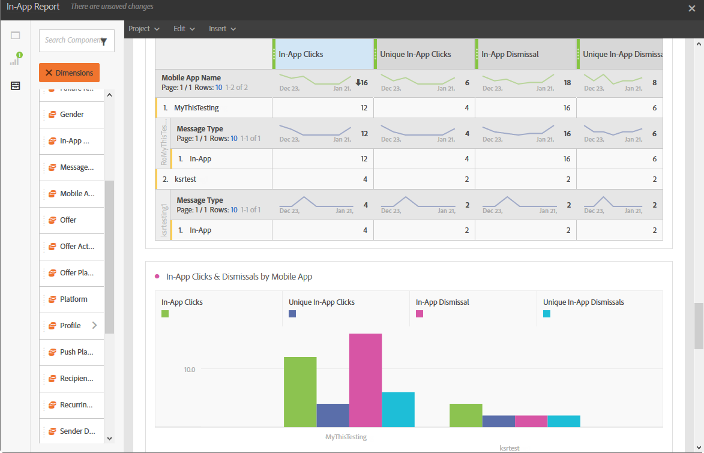

# アプリ内レポート{#in-app-report}

>[!CAUTION]
>
>をドラッグ&amp;ドロップする必要があります **[!UICONTROL メッセージタイプ]** 配信タイプ（この場合はアプリ内配信）に応じてデータを分割するためのテーブルへの指標です。

この **アプリ内** レポートは、アプリ内配信に関する詳細を提供します。

各テーブルは、概要番号とグラフで表されます。 それぞれのビジュアライゼーション設定で、詳細の表示方法を変更できます。

最初のテーブル **アプリ内エンゲージメントサマリー** は、日別、モバイルアプリ別および配信別の 3 つのカテゴリに分類されます。 配信に対する受信者の反応に使用できるデータが含まれます。

* **[!UICONTROL 処理/送信済み]**：アプリ内配信用の送信の合計数。
* **[!UICONTROL 配信完了]**：送信されたメッセージの合計数に対して、正常に送信されたアプリ内メッセージの数。
* **[!UICONTROL インプレッション]**:トリガー条件が満たされたかどうかに応じて、受信者に表示されるアプリ内メッセージの合計。
* **[!UICONTROL ユニークインプレッション]**：受信者によるインプレッション数。
* **[!UICONTROL アプリ内クリックスルー率]**：メッセージを表示したユーザーと比較して、ボタン 1 またはボタン 2 をクリックしたユーザーの割合。
* **[!UICONTROL アプリ内解除率]**：受信者が解除したアプリ内メッセージの割合。

2 番目のテーブル **アプリ内クリック数および解除数** は、日別、モバイルアプリ別および配信別の 3 つのカテゴリに分類されます。 配信ごとの受信者の行動に使用できるデータが含まれます。

* **[!UICONTROL アプリ内クリック数]**：ボタン 1 またはボタン 2 をクリックした受信者の合計数。
* **[!UICONTROL ユニークアプリ内クリック数]**：受信者がボタン 1 またはボタン 2 をクリックした回数。
* **[!UICONTROL アプリ内解除]**：受信者が「閉じる」ボタンをクリックするか自動解除することによって解除したメッセージの合計数。
* **[!UICONTROL ユニークアプリ内解除]**：受信者がアプリ内メッセージを閉じた回数。
