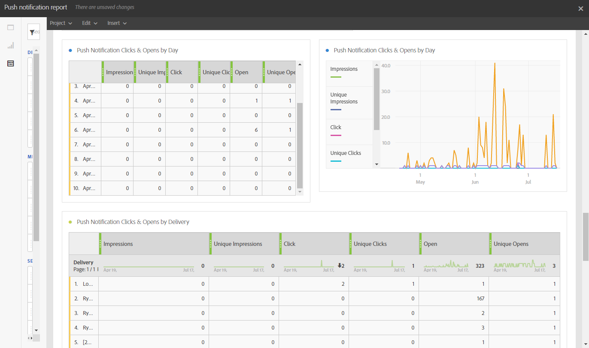

# プッシュ通知レポート{#push-notification-report}

>[!CAUTION]
>
>配信タイプに応じてデータを分割するには、**[!UICONTROL メッセージタイプ]** 指標をテーブルにドラッグ&amp;ドロップする必要があります。この場合、プッシュ通知配信です。

**プッシュ通知** レポートは、Adobe Campaignでのプッシュ通知のマーケティングパフォーマンスの詳細を提供します。 この標準レポートを使用すると、ユーザーがプッシュ通知、モバイルアプリケーション、配信とやり取りする方法を理解できます。

各テーブルは、概要番号とグラフで表されます。 それぞれのビジュアライゼーション設定で、詳細の表示方法を変更できます。

最初の表 **プッシュ通知エンゲージメントの概要** は、日別、モバイルアプリ別および配信別の 3 つのカテゴリに分類されています。 配信に対する受信者の反応に使用できるデータが含まれます。

* **[!UICONTROL 処理済み/送信済み]**：送信されたプッシュ通知の合計数。
* **[!UICONTROL 配信済み]**：送信されたプッシュ通知の合計数に対する、正常に送信されたプッシュ通知の数。
* **[!UICONTROL インプレッション数]**：プッシュ通知がデバイスに配信され、通知センターにそのまま残った回数。 ほとんどの場合、インプレッション数は、配信された数に類似している必要があります。 これにより、デバイスがメッセージを取得し、その情報をサーバーに中継します。
* **[!UICONTROL ユニークインプレッション数]**：受信者ごとのインプレッション数。
* **[!UICONTROL クリックスルー率]**：プッシュ通知に対してアクションを起こしたユーザーの割合。
* **[!UICONTROL 開封率]**：開封されたプッシュ通知の割合。

2 つ目の表 **プッシュ通知のクリック数と開封数** は、日別、モバイルアプリ別および配信別の 3 つのカテゴリに分類されます。 配信ごとの受信者の行動に使用できるデータが含まれます。

* **[!UICONTROL インプレッション数]**：受信者が閲覧したプッシュ通知の合計。
* **[!UICONTROL ユニークインプレッション数]**：受信者ごとのインプレッション数。
* **[!UICONTROL クリック]**：ユーザーがプッシュ通知をデバイスに配信してクリックした回数。 ユーザーは通知を表示しようとしていましたが、この通知はプッシュオープントラッキングに移動されるか、拒否されます。
* **[!UICONTROL ユニーククリック数]**：ユニークユーザーがプッシュ通知を操作した回数（通知またはボタンのクリックなど）。
* **[!UICONTROL オープン]**：デバイスに配信され、ユーザーがクリックしてアプリを開いたプッシュ通知の合計数。 これは、プッシュクリックと似ていますが、通知が閉じられた場合にプッシュオープンがトリガーされない点が異なります。
* **[!UICONTROL ユニーク開封数]**：配信されたメッセージを開いた受信者の数。
