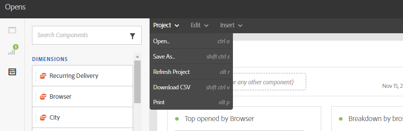

# レポートのインターフェイス{#reporting-interface}

上部のツールバーから、レポートを変更、保存または印刷できます。

「**プロジェクト**」タブでは、次の操作を実行できます。

* **開く…**：以前に作成したレポートまたはテンプレートを開きます。
* **名前を付けて保存…**：テンプレートを複製し、変更できるようにします。
* **プロジェクトを更新**：新しいデータおよびフィルターへの変更に基づいてレポートを更新します。
* **CSV をダウンロード**：CSV ファイルにレポートをエクスポートします。

「**編集**」タブでは、次の操作を実行できます。

* **取り消し**：ダッシュボードで最後に行った操作をキャンセルします。
* **すべてクリア**：ダッシュボードのすべてのパネルを削除します。

「**挿入**」タブでは、ダッシュボードにグラフやテーブルを追加してレポートをカスタマイズできます。

* **新しい空のパネル**：ダッシュボードに新しい空のパネルを追加します。
* **新しいフリーフォーム**：ダッシュボードに新しいフリーフォームテーブルを追加します。
* **新しい折れ線グラフ**：ダッシュボードに新しい折れ線グラフを追加します。
* **新しい棒グラフ**：ダッシュボードに新しい棒グラフを追加します。

**関連トピック：**

* [パネルの追加](adding-panels.md)
* [ビジュアライゼーションの追加](adding-visualizations.md)
* [コンポーネントの追加](adding-components.md)

## タブ {#tabs}

左側のタブを使用して、レポートを作成し、必要に応じてデータをフィルターできます。

これらのタブから、次の項目にアクセスできます。

* **[!UICONTROL パネル]**：レポートに空のパネルまたはフリーフォームを追加して、データのフィルタリングを開始します。 詳しくは、パネルの追加セクションを参照してください。
* **[!UICONTROL ビジュアライゼーション]**：選択したビジュアライゼーション項目をドラッグ＆ドロップして、レポートにグラフィカルなディメンションを設定します。 詳しくは、ビジュアライゼーションの追加セクションを参照してください。
* **[!UICONTROL コンポーネント]**：様々なディメンション、指標、セグメントおよび期間でレポートをカスタマイズします。

## ツールバー {#toolbar}

ツールバーは、ワークスペースの上にあります。 様々なタブで構成されており、例えば、レポートを変更、保存、共有または印刷できます。

**関連トピック：**

* [パネルの追加](adding-panels.md)
* [ビジュアライゼーションの追加](adding-visualizations.md)
* [コンポーネントの追加](adding-components.md)

### 「プロジェクト」タブ {#project-tab}

「**プロジェクト**」タブでは、次の操作を実行できます。

* **開く…**：以前に作成したレポートまたはテンプレートを開きます。
* **名前を付けて保存…**：テンプレートを複製し、変更できるようにします。
* **プロジェクトを更新**：新しいデータおよびフィルターへの変更に基づいてレポートを更新します。
* **CSV をダウンロード**：CSV ファイルにレポートをエクスポートします。
* **[!UICONTROL 印刷]**：レポートを印刷します。

### 「編集」タブ {#edit-tab}

「**編集**」タブでは、次の操作を実行できます。

* **取り消し**：ダッシュボードで最後に行った操作をキャンセルします。
* **すべてクリア**：ダッシュボードのすべてのパネルを削除します。

### 「挿入」タブ {#insert-tab}

「**挿入**」タブでは、ダッシュボードにグラフとテーブルを追加してレポートをカスタマイズできます。

* **新しい空のパネル**：ダッシュボードに新しい空のパネルを追加します。
* **新しいフリーフォーム**：ダッシュボードに新しいフリーフォームテーブルを追加します。
* **新しい折れ線グラフ**：ダッシュボードに新しい折れ線グラフを追加します。
* **新しい棒グラフ**：ダッシュボードに新しい棒グラフを追加します。
