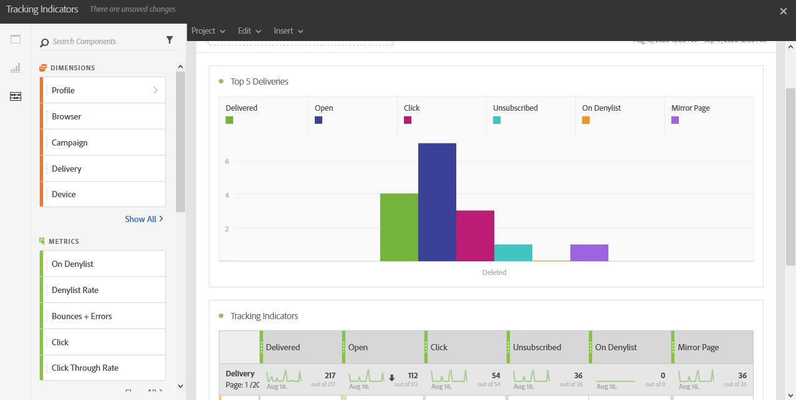

# トラッキング指標{#tracking-indicators}

**[!UICONTROL トラッキング指標]**&#x200B;レポートには、メールメッセージを受信した後の行動を追跡するための主要な指標が含まれています。

>[!NOTE]
>
>このデータにアクセスするには、配信の準備時にトラッキングを有効にする必要があります。

**[!UICONTROL トラッキング指標]**&#x200B;テーブルと&#x200B;**上位 5 件の配信**&#x200B;グラフには、次のようなメールトラッキングに使用できるデータが含まれています。

* **[!UICONTROL 配信済み]**：正常に送信されたメッセージ数。 発生したエラー（バウンス）が考慮されます。 ただし、苦情（スパム報告）や「外出中」などの不在メッセージは考慮されません。
* **開封**：1 つの配信で、あるメッセージが開かれた回数。
* **クリック**：1 つの配信で、あるコンテンツがクリックされた回数。
* **購読解除済み**：購読リンクがクリックされた回数。
* **スパム**：メールをスパムとして報告した受信者の数。
* **ミラーページ**：ミラーページリンクがクリックされた回数。
