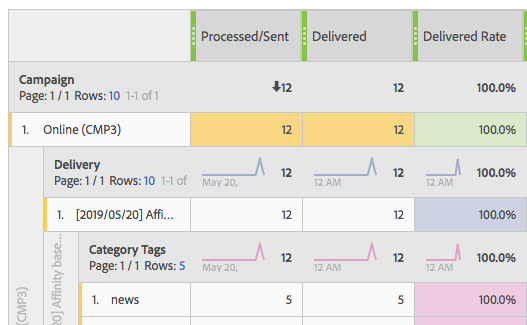

# トラブルシューティング{#troubleshooting}

この節では、動的レポートに関するよくある質問について説明します。

## ユニーク開封数およびユニーククリック数の場合、集計行のカウントが個々の行のカウントと一致しません {#unique-open-clicks-no-match}

これは想定されている動作です。
次の例を使って、この動作について説明します。

プロファイル P1 および P2 にメールが送信されます。

P1 が 1 日目にメールを 2 回開き、2 日目にツリー時間を開きます。

一方、P2 では、メールは最初の日に 1 回開かれ、次の日には開かれません。
次に、送信されたメールに対するプロファイルのインタラクションを視覚的に示します。

<table> 
 <thead> 
  <tr> 
   <th align="center"> <strong> 日 </strong>   </th> 
   <th align="center"> <strong> 開封数 </strong>   </th> 
   <th align="center"> <strong> ユニーク開封数 </strong>  </th> 
  </tr> 
 </thead> 
 <tbody> 
  <tr> 
   <td align="center"> 1 日目   </td> 
   <td align="center"> 2 + 1 = 3  </td> 
   <td align="center"> 1 + 1 = 2  </td> 
  </tr> 
  <tr> 
   <td align="center"> 2 日目   </td> 
   <td align="center"> 3 + 0 = 3  </td> 
   <td align="center"> 1 + 0 = 1  </td> 
  </tr>
 </tbody> 
</table>

ユニーク開封数の合計を把握するには、**[!UICONTROL ユニーク開封数]** の行カウントの合計を求める必要があります。この結果、値は 3 になります。 ただし、メールのターゲットとなったプロファイルは 2 つだけなので、開封率は 150% となる必要があります。

100 を超えるパーセンテージを取得しないように、**[!UICONTROL ユニーク開封数]** の定義は、開封された一意の broadlog の数に維持されます。 この場合、P1 が 1 日目と 2 日目にメールを開封しても、ユニーク開封数は 1 のままです。

その結果、次のテーブルが表示されます。

<table> 
 <thead> 
  <tr> 
   <th align="center"> <strong></strong>   </th> 
   <th align="center"> <strong> 開封数 </strong>   </th> 
   <th align="center"> <strong> ユニーク開封数 </strong>  </th> 
  </tr> 
 </thead> 
 <tbody> 
  <tr> 
   <td align="center"> <strong> Day </strong>  </td> 
   <td align="center"> <strong> 6 </strong>  </td> 
   <td align="center"> <strong> 2</strong>  </td>
  </tr> 
  <tr> 
   <td align="center"> 1 日目   </td> 
   <td align="center"> 3  </td> 
   <td align="center"> 2  </td>
  </tr> 
  <tr> 
   <td align="center"> 2 日目   </td> 
   <td align="center"> 3  </td> 
   <td align="center"> 1  </td> 
  </tr> 
 </tbody> 
</table>

>[!NOTE]
>
>ユニーク件数は HLL ベースのスケッチに基づいています。大きな件数では、わずかな不正確な情報が生じる場合があります。

## オープン数がデータベース数と一致しません {#open-counts-no-match-database}

これは、動的レポートでヒューリスティックが使用され、**[!UICONTROL 開く]** アクションを追跡できない場合でも開封数を追跡することが原因である可能性があります。

例えば、ユーザーがクライアントで画像を無効にし、メール内のリンクをクリックした場合、**[!UICONTROL 開く]** はデータベースで追跡されませんが、**[!UICONTROL クリック]** は追跡されます。

したがって、**[!UICONTROL 開く]** トラッキングログの数が、データベース内で同じ数にならない場合があります。

このような状況は、「メールのクリックがメールの開封を意味する **と追加さ** ます。

>[!NOTE]
>
>一意のカウントは HLL ベースのスケッチに基づいているので、カウント間に小さな不一致が発生する場合があります。

## 繰り返し配信またはトランザクション配信のカウントはどのように計算されますか。 {#counts-recurring-deliveries}

繰り返し配信とトランザクション配信を操作する場合、カウントは親と子の両方の配信に関連付けられます。
例えば、**R1** という名前の繰り返し配信を、1 日目（RC1）、2 日目（RC2）、3 日目（RC3）に毎日実行するように設定するとします。
1 人のユーザーのみが、すべての子配信を複数回開いたとします。 この場合、個々の繰り返し子配信では、**[!UICONTROL オープン]** カウントがそれぞれ 1 として表示されます。
ただし、同じユーザーがすべての配信をクリックしたので、親の繰り返し配信にも **[!UICONTROL 一意のオープン]** が 1 として表示されます。

レポートは次のようになります。

<table> 
 <thead> 
  <tr> 
   <th align="center"> <strong> 配信 </strong>   </th> 
   <th align="center"> <strong> 送信済み </strong>   </th> 
   <th align="center"> <strong> 配信済み </strong>   </th>
   <th align="center"> <strong> 開封数 </strong>   </th> 
   <th align="center"> <strong> ユニーク開封数 </strong>  </th>
  </tr> 
 </thead> 
 <tbody> 
  <tr> 
   <td align="center"> <strong>R1</strong>  </td> 
   <td align="center"> <strong>100</strong>  </td> 
   <td align="center"> <strong>90</strong>  </td> 
   <td align="center"> <strong>10</strong>  </td> 
   <td align="center"> <strong>3</strong>  </td> 
  </tr> 
  <tr> 
   <td align="center"> RC1  </td> 
   <td align="center"> 20  </td> 
   <td align="center"> 20  </td> 
   <td align="center"> 6  </td> 
   <td align="center"> 1  </td> 
  </tr>
    <tr> 
   <td align="center"> RC2  </td> 
   <td align="center"> 40  </td> 
   <td align="center"> 30  </td> 
   <td align="center"> 2  </td> 
   <td align="center"> 1  </td> 
  </tr> 
    <tr> 
   <td align="center"> RC3  </td> 
   <td align="center"> 40  </td> 
   <td align="center"> 40  </td> 
   <td align="center"> 2  </td> 
   <td align="center"> 1  </td> 
  </tr> 
 </tbody> 
</table>

## レポートのテーブルでカラーが示す意味は何ですか？ {#reports-color-signification}

レポートに表示されるカラーはランダム化され、パーソナライズすることはできません。 進捗バーを表し、レポートで達成された最大値をより適切にハイライト表示するために表示されます。

次の例では、値が 100% なので、セルは同じ色です。

**[!UICONTROL 条件付き書式]** をカスタムに変更した場合、値が上限に達すると、セルの色が青くなります。 一方、下限に達すると赤くなります。

例えば、ここでは **[!UICONTROL 上限]** を 500 に、**[!UICONTROL 下限]** を 0 に設定します。

## 値「N/A」がレポートに表示されるのはなぜですか。

値 **なし** は、動的レポートに表示される場合があります。 これは、次の 3 つの理由で表示される場合があります。

* 結果に不一致が生じないようにするため、配信が削除され、ここに **N/A** と表示されました。
* **[!UICONTROL トランザクション配信]** ディメンションをレポートにドラッグ&amp;ドロップすると、結果として値 **N/A** が表示される場合があります。 これは、動的レポートがトランザクションでない場合でも、すべての配信を取得するからです。 これは、**[!UICONTROL 配信]** ディメンションをレポートにドラッグ&amp;ドロップする際にも発生する可能性がありますが、この場合、**N/A** 値はトランザクション配信を表します。
* ディメンションに関連しない指標と共にディメンションが使用される場合。 次の例では、この配信で **[!UICONTROL クリック]** 数が 0 に設定されていても、**[!UICONTROL トラッキング URL]** ディメンションで分類が追加されます。

  

## カスタムターゲットマッピングを使用すると、配信のレポートに不完全なデータが表示される

読み込んだカスタムターゲットマッピングを配信で使用していて、別のレポートにデータが表示されない場合は、これらのターゲットマッピングに対してレポートのエンリッチメントが作成されなかった可能性があります。

これを解決するには：

* XML からターゲットマッピングを読み込んだ後、レポートエンリッチメントも読み込む必要があります。

* ターゲットマッピングを読み込む代わりに、Adobe Campaign web ユーザーインターフェイスで直接作成すると、レポートのエンリッチメントが自動的に作成されます。

## 列ヘッダー番号と行の合計の不一致

次の場合には、列ヘッダー番号とすべての行の合計が一致しないことが予想されます。

* **ユニーク指標**：ユニーク指標を使用すると、単純な行数の合計ではなく受信者 ID に基づいているので、ヘッダーに表示される合計数を変更できます。 その結果、1 つのプロファイルが様々なディメンションにわたって多数のイベントをトリガーし、データセットに複数の行が含まれる場合があります。 ただし、ヘッダーでは、各プロファイルは 1 回だけカウントされます。

  例：

   * プロファイル A が 3 日間でメールを開封した場合、日別の分類では A が 3 行で表示されますが、ヘッダーでは A が 1 としてカウントされます。

   * プロファイル A が同じ日にメール内の 3 つの異なるリンクをクリックすると、トラッキング URL による分類の 3 行に A が表示されますが、ヘッダーでは A が 1 としてカウントされます。 同じことが、デバイスとブラウザーによる分類にも当てはまります。

* **オープン指標**：開封数は、実際のオープンイベントとユニーククリックイベント（受信者 ID あたり）の両方の合計を集計することによって決定されます。ただし、オープンイベントがないとメールリンクをクリックできないので、オープンイベントが発生していない場合は除きます。

  例：

   * トラッキング対象のメール（URL U1 を含む）をプロファイル A が開くと、null と示された URL を持つオープンイベントとして登録されます。 U1 を後でクリックすると、クリックイベントが生成されます。 A による U1 のクリックもオープンイベントとしてカウントされますが、U1 用の特定のオープンイベントはありません。 したがって、A はユニーク開封数の 1 回だけカウントされます。

   * プロファイル R が 1 日目にメールを開き、開いているイベントを登録して、リンクをクリックします。 次の 2 日間で、R はメールを再度開き、リンクを再度クリックして、毎日クリックイベントを生成します。 R のエンゲージメントは、オープン数では毎日追跡されますが、R は、一意のエンゲージメントに焦点を当てて、列ヘッダーで 1 回だけカウントされます。

* **イベントの否定**：レポートでは、イベントの否定は、最初に成功とマークされたが、再試行後に最終的に失敗した配信試行を意味します。 これらは–1 のカウントで示されます。 混乱を避けるために、これらの負の数は、表示された配信指標数から除外されます。 その結果、配信指標のすべての行の合計が列ヘッダー番号と一致しない場合があります。
