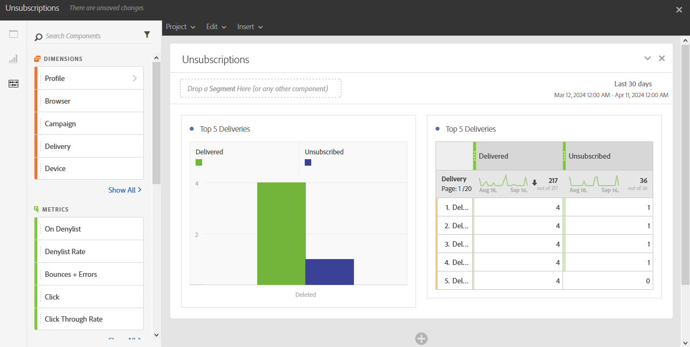

# 購読解除{#unsubscriptions}

**[!UICONTROL 購読解除]**&#x200B;レポートは、最も購読解除が多い配信を特定します。

**[!UICONTROL 上位 5 件の配信]**&#x200B;テーブルおよびグラフには、配信されたメッセージ数が最も多い上位 5 件の配信と、購読解除した受信者数が表示されます。 ここにリストされるデータは、メッセージの購読解除リンクのクリック数に基づいています。
