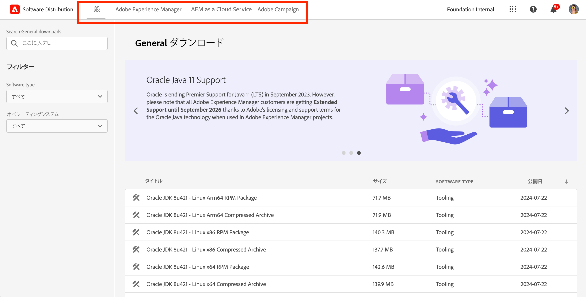
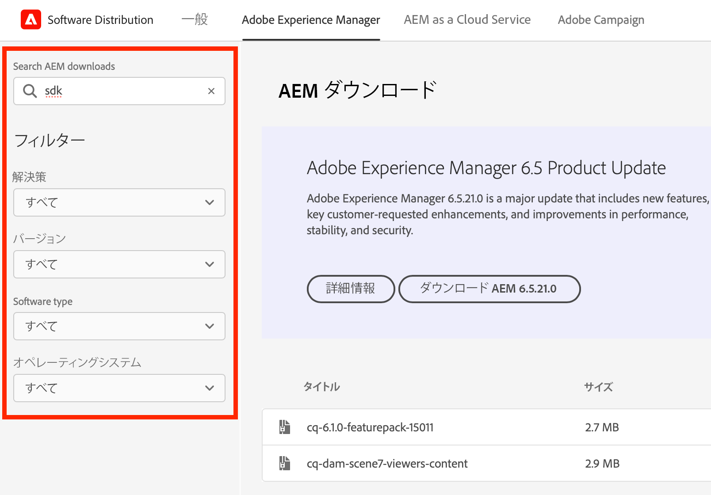
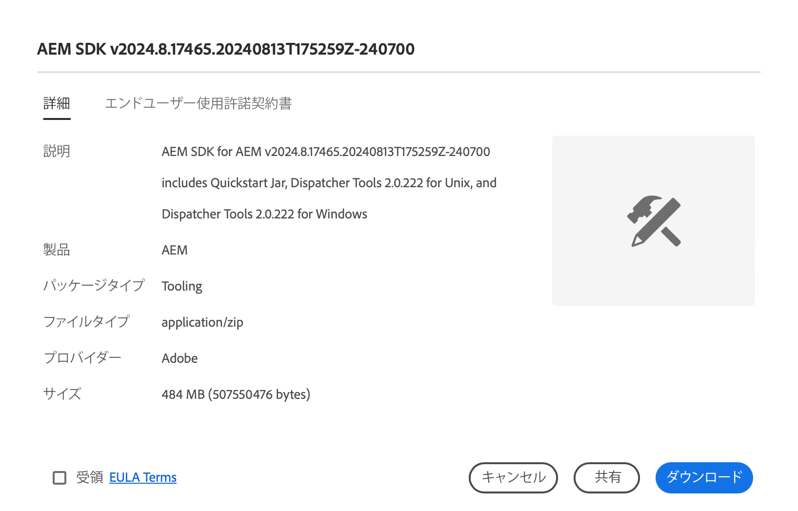

# ソフトウェア配布

ソフトウェア配布を使用してAdobe Experience Cloud ソフトウェアをダウンロードする方法を説明します。

## はじめに

ソフトウェア配布は、Adobe Experience Cloud ソフトウェアを検索およびダウンロードするための効率的なエクスペリエンスを提供します。 Adobeの承認済みソフトウェアパッケージとパートナー企業のパッケージは、次の製品で使用できます。

1. **Adobe Experience Manager** - サポート対象のすべてのAEM バージョンに関する、サービスとメンテナンス、セキュリティ、ツールなどに関するすべて
1. **Adobe Experience Manager as a [!UICONTROL Cloud Service]** - [!UICONTROL AEM Cloud SDK]、[!UICONTROL AEM Cloud] 移行ツールなど
1. **Adobe Campaign** – 現在のすべての [!DNL Campaign] インストーラーバージョンと関連ツール
1. **一般** - Adobeユーザー向けの [!DNL Oracle] JDK を含む汎用ツール

ソフトウェア配布の使用は、次のように簡単です。

1. [ソフトウェア配布へのアクセス](#accessing)
1. [製品の選択](#selecting)
1. [ダウンロードの検索](#finding)
1. [ソフトウェアのダウンロード](#downloading)

## ソフトウェア配布へのアクセス {#accessing}

ソフトウェア配布にアクセスするには、[`https://experience.adobe.com/downloads`](https://experience.adobe.com/downloads) に移動し、Adobe IDを使用して [!UICONTROL  ソフトウェア配布 ] にログインします。

## 製品の選択 {#selecting}

メニューに示すように、ソフトウェア配布 UI は製品別に整理されています。

「**一般**」タブに移動すると、汎用ソフトウェアのダウンロードが見つかります。

ソフトウェアをダウンロードするメニューの製品をタップまたはクリックします。 組織がライセンスを取得した製品のみをダウンロードできます。

## ダウンロードの検索 {#finding}

目的の製品タブを選択したら、関連するすべてのダウンロードが表示されます。 左側のパネルの検索フィルターを使用すると、ダウンロードをすばやく見つけることができます。 フィルターオプションは製品によって異なります。

## ソフトウェアのダウンロード {#downloading}

表示されたダウンロードをタップまたはクリックすると、ダイアログが開き、ダウンロードに関する詳細情報が表示されます。 例えば、説明、プロバイダー名、EULA を確認できます。

「**ダウンロード**」ボタンを有効にするには、「**EULA 利用条件に同意する**」を選択して EULA に同意する必要があります。

「**共有**」をタップまたはクリックして URL をコピーすることで、その特定のダウンロードへのリンクを共有することもできます。

## パッケージ共有 {#package-share}

2020 年 6 月、AEMの [!UICONTROL Software Distribution] は [!UICONTROL Package Share] に、[!DNL Campaign] の [!DNL Neolane] は置き換えました。 直感的なユーザーインターフェイス、検索の簡素化、ダウンロード速度の大幅な向上により、ソフトウェア配布を使用したExperience Cloud向けソフトウェアパッケージのダウンロード体験が向上します。

>[!IMPORTANT]
>
>[!UICONTROL Package Share] または [!DNL Neolane] からのログイン資格情報は、Adobe全体のセキュリティ標準でログインする機能を提供する [!UICONTROL  ソフトウェア配布 ] では機能しません。 Adobe IDが不明な場合は、組織内のサポート管理者にお問い合わせください。

>[!NOTE]
>
>「[!UICONTROL ソフトウェア配布]」では、ブラウザーのダウンロードのみがサポートされます。新規インストールで AEM [!UICONTROL パッケージマネージャー]を使用する場合は、パッケージをローカルフォルダーにダウンロードし、そこからパッケージをインストールすることをお勧めします。
