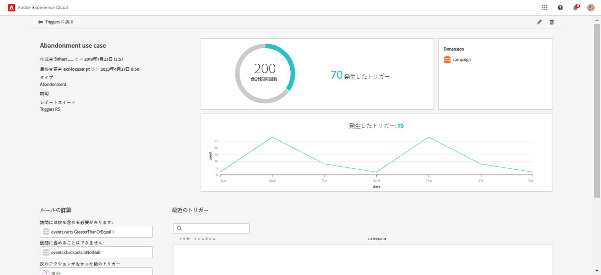

# Experience Cloud のトリガーの作成 {#create-triggers}

>[!NOTE]
>
> Experience Cloudトリガー向けの新しいユーザーインターフェイスは、消費者の行動を管理し、ユーザーエクスペリエンスをパーソナライズするための直感的なエクスペリエンスを提供します。 前のインターフェイスに戻るには、 **[!UICONTROL クラシックモードに移動]** 」ボタンをクリックします。

トリガーを作成し、トリガーの条件を設定します。例えば、買い物かごの放棄のような指標や製品名のようなディメンションなど、訪問中のトリガーのルールに対する条件を指定できます。ルールを満たすと、トリガーが実行されます。

1. Experience Cloudで、詳細設定メニュー、「トリガー」の順に選択します。

   

1. トリガーのホームページで、 **[!UICONTROL 作成トリガー]**&#x200B;をクリックし、トリガーのタイプを指定します。

   次の 3 種類のトリガーを使用できます。

   * **[!UICONTROL 放棄]**:訪問者がトリガーを表示したが買い物かごに何も追加しない場合に実行する製品を作成できます。

   * **[!UICONTROL アクション]**:例えば、トリガーのサインアップ、電子メールの購読またはクレジットカードの申し込み（確認）の後に実行するメッセージを作成できます。 小売業者の場合、ロイヤルティプログラムにサインアップする訪問者用のトリガーを作成できます。メディアおよびエンターテインメントでは、特定のショーを観て、調査に回答したいと思われる訪問者用のトリガーを作成できます。

   * **[!UICONTROL セッション開始およびセッション終了]**:セッション開始およびトリガー終了イベントのイベントを作成します。

   

1. を追加します。 **[!UICONTROL 名前]** および **[!UICONTROL 説明]** トリガーに

1. Analytics を選択します。 **[!UICONTROL レポートスイート]** このトリガーに使用 この設定は、使用するレポートデータを特定します。

   [レポートスイートの詳細を説明します](https://experienceleague.adobe.com/docs/analytics/admin/admin-tools/manage-report-suites/c-new-report-suite/t-create-a-report-suite.html?lang=ja).

1. を選択します。 **[!UICONTROL 次のアクションがなかった後のトリガー:]** 有効期間。

1. 次の **[!UICONTROL 訪問には次を含める必要があります]** および **[!UICONTROL 訪問に次を含めることはできません]** カテゴリに基づいて、発生させたいと思わない条件や訪問者の行動を定義できます。 次を指定できます。 **および** または **または** 論理式を指定します。

   例えば、シンプルな買い物かご放棄トリガーのルールは、次のようになります。

   * **[!UICONTROL 訪問には次を含める必要があります]**: `Carts (metric) Is greater or equal to 1` をクリックします。
   * **[!UICONTROL 訪問に次を含めることはできません]**: `Checkout (metric) Exists.` をクリックして、買い物かごの品目を購入した訪問者を削除します。

   

1. クリック **[!UICONTROL コンテナ]** ：ルールを定義するルール、条件、またはフィルターを設定して保存します。トリガー イベントを同時に発生させるには、同じコンテナにイベントを配置する必要があります。

   各コンテナは、ヒットレベルで別々に処理されます。つまり、2 つのコンテナが **[!UICONTROL および]** 演算子を使用する場合、ルールは 2 つのヒットが要件を満たす場合にのみ条件を満たします。

1. 次の **[!UICONTROL メタデータ]** フィールド、クリック **[!UICONTROL +Dimension]** を使用して、訪問者の行動に関連する特定のキャンペーンディメンションまたは変数を選択します。

   

1. 「**[!UICONTROL 保存]**」をクリックします。

1. 新しく作成した **[!UICONTROL トリガー]** リストから、トリガーの詳細レポートにアクセスします。

   

1. トリガーの詳細ビューから、発生したトリガー数のレポートにアクセスできます。 必要に応じて、鉛筆アイコンを使用してトリガーを編集できます。

   
